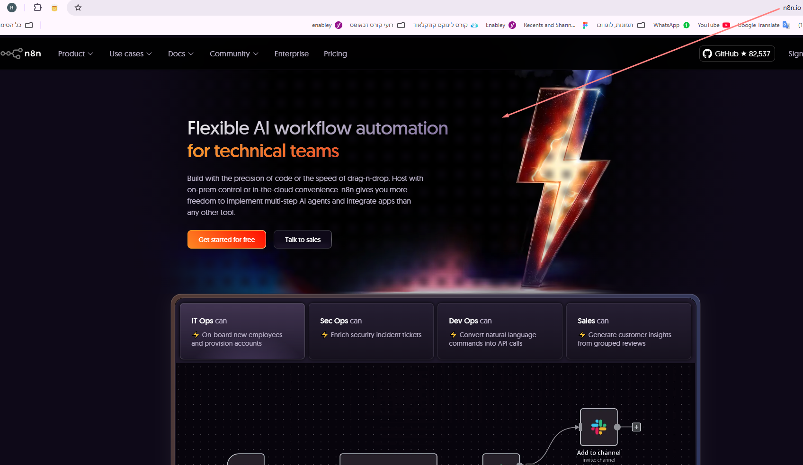
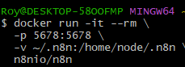
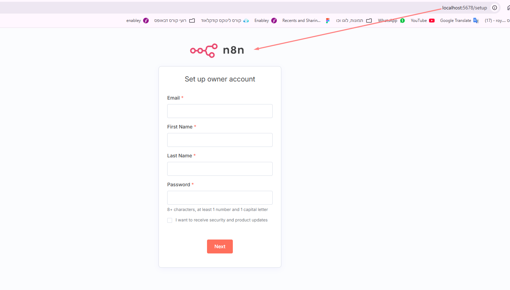

# Setup and Installation

This section provides instructions for setting up the project.

- **[Cloud Version](./cloud.version.png)**
- **[Docker Container](./docker.container.png)**
- **[Git Bash](./git.bash.png)**
- **[Local Host Version](./local.host.version.png)**

---

##  Two Ways I Used to Run n8n

### 1. Cloud Version (n8n.io)

The easiest way to start is with the hosted version at [https://n8n.io](https://n8n.io)

- No installation required
- Free tier is available
- After a few workflows or executions per day – you might need to upgrade
- Great for beginners

 This is the version I used to build the first version of this automation.


---

### 2. Local Version (Docker)

You can also run n8n on your local machine using Docker:

####  Step-by-step:

1. Make sure you have Docker installed
2. Open **Git Bash** and run the following command:

```bash
docker run -it --rm \
  -p 5678:5678 \
  -v ~/.n8n:/home/node/.n8n \
  n8nio/n8n
```



3. Verify that the container is running:
```bash
docker ps
```

 
4. Open your browser at:
[http://localhost:5678](http://localhost:5678)



 This gives you full control – no limits, full flexibility.

---

##  What I learned

- The difference between running something in the cloud vs locally
- How Docker helps spin up an environment in seconds
- How to manage persistence using volumes
- How to access n8n from different environments

