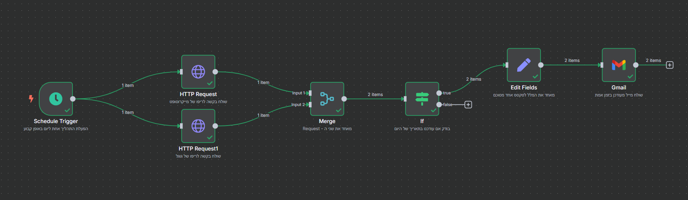

# 02 – Workflow Architecture

This folder contains a description of the n8n automation I built to monitor new or recently updated repositories from major tech companies on GitHub.

---

##  Workflow Structure

1. **Schedule Trigger** – Triggers the flow once a day
2. **HTTP Request** – Pulls data from GitHub API for Microsoft and Google
3. **Merge Node** – Combines both responses
4. **IF Node** – Filters repositories updated today
5. **Edit Fields (Set)** – Prepares a summary text for each item and then unifies all into one
6. **Gmail** – Sends a single email with the full summary

---

## Node Descriptions

- **Schedule**: Runs once a day at 08:00 AM.
- **HTTP Request 1**: Sends a GET request to: `https://api.github.com/orgs/microsoft/repos?per_page=1&sort=updated`.
- **HTTP Request 2**: Sends a GET request to: `https://api.github.com/orgs/google/repos?per_page=1&sort=updated`.
- **Merge**: Combines both responses into one item list.
- **IF**: Checks if `updated_at` contains today's date.
- **Edit Fields**: Creates field `email_body` and joins all summaries into one block of text.
- **Gmail**: Sends one email with the combined summary.

---
## 🔗 Related Links

- [GitHub API – Microsoft](https://api.github.com/orgs/microsoft/repos)
- [GitHub API – Google](https://api.github.com/orgs/google/repos)
- [n8n.io – Homepage](https://n8n.io)

