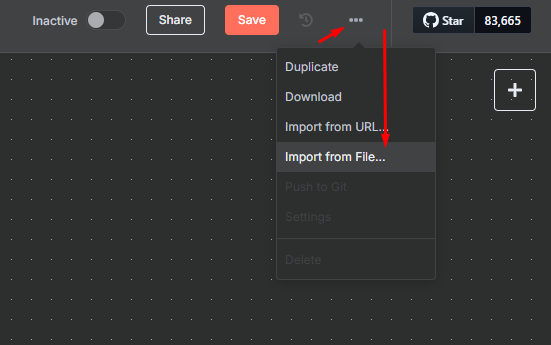
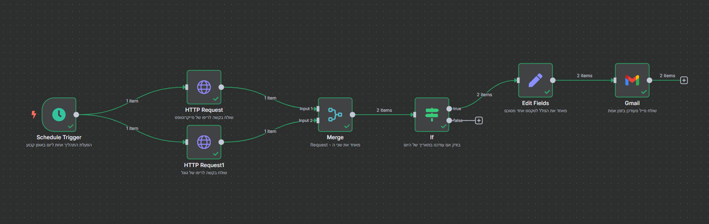
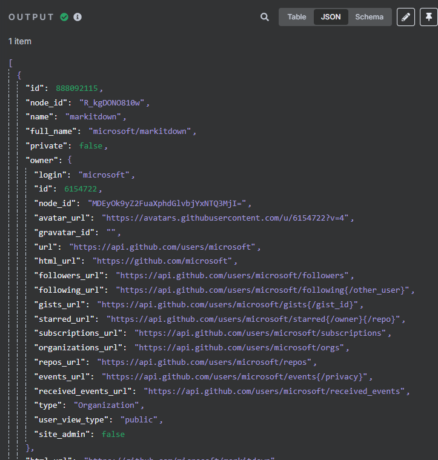
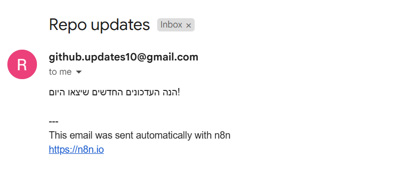

# 03 – Examples and Workflow Demonstration

This folder contains the full exported workflow of the automation, along with explanations for each part.

---

## Workflow JSON File

File name:
```
github-tracker-workflow.json
```

You can import the file [github-tracker-workflow.json](./github-tracker-workflow.json) into n8n to see the complete automation in action.


---

##  What Does This Workflow Do?

1. Triggers once a day (Schedule)
2. Sends two HTTP requests to GitHub API (Microsoft and Google)
3. Merges both responses (Merge)
4. Filters repositories updated today (IF)
5. Combines all texts into one (Edit Fields)
6. Sends one email with the summary (Gmail)


---

##  Example Output from HTTP Request

```json
{
  "name": "n8n",
  "html_url": "https://github.com/n8n-io/n8n",
  "updated_at": "2025-04-20T14:00:00Z"
}
```


---


##  Note About the Final Email Screenshot

The screenshot of the received email shown below was generated using a test run in n8n to verify that the automation works correctly. At the time this project was completed (today), there were no recent repository updates from Google or Microsoft, so no actual data appeared in the live run.


