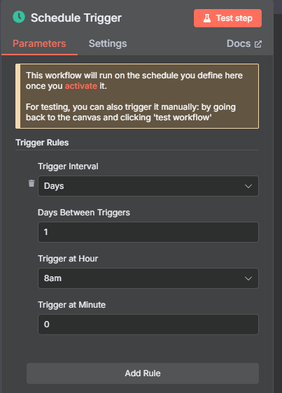
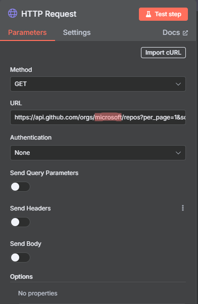
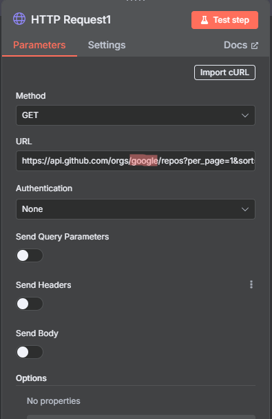
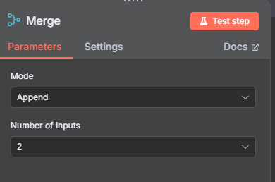
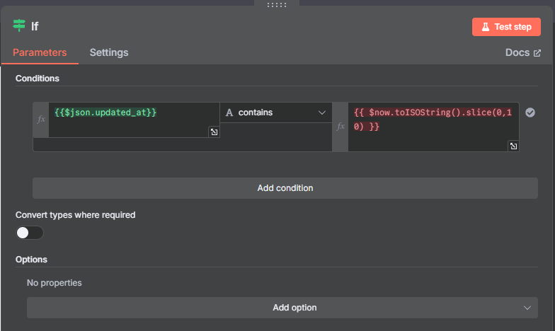
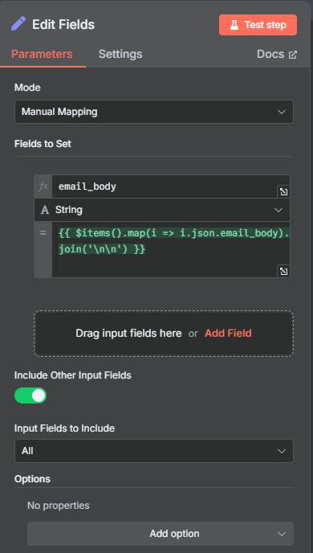
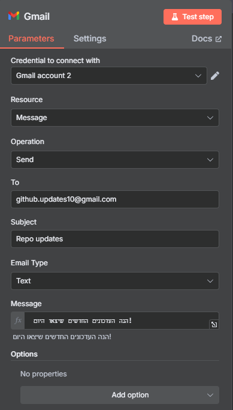

# 04 – What I Learned (Learning Nodes)

##  Section 1 – Why I Chose Each Node

### Schedule Trigger
The automation runs once a day, so I used a Schedule node to trigger the workflow every morning at a fixed hour.


---

### HTTP Request – Why These URLs?
The URLs I used:
```
https://api.github.com/orgs/microsoft/repos?per_page=1&sort=updated
https://api.github.com/orgs/google/repos?per_page=1&sort=updated
```

I chose them because:
- `https://api.github.com` is GitHub’s main API
- `/orgs/{organization}/repos` returns the organization’s repositories
- `?per_page=1` limits the response to one item
- `&sort=updated` ensures the most recently updated repo is shown first



---

### Merge
Combines the results from the two HTTP Request nodes (Google and Microsoft) into a single list of items.


---

### IF – Filter by Date

Condition used:
```js
{{$json.updated_at}} contains {{ $now.toISOString().slice(0, 10) }}
```

Why?
- `$json.updated_at` is a date field from GitHub’s JSON
- `$now.toISOString().slice(0, 10)` gets today’s date in YYYY-MM-DD format
- The condition checks if the repository was updated today


---

### Edit Fields (Set)
I created a new field called `email_body` where each item receives a formatted text:
```js
{{ $items().map(i => i.json.email_body).join('\n\n') }}
```
To combine all lines into a single item.


---

### Gmail
Sent only one email with all the combined content using:
```js
{{ $json.email_body }}
```


---

##  Summary – What I Learned

- How to build a real automation from scratch with n8n
- What an API is, what endpoints are, and how HTTP requests work
- How to access values inside JSON using `$json.name`, `$json.updated_at`, etc.
- That IF is not a “filter”, but a condition checker that controls the flow
- How to combine multiple items into a single block using `.map()` and `.join()`
- What a URL is and how it's structured
- What credentials are and why they’re needed when connecting to APIs
- What a status code is and how it reflects success/failure
- How data flows in n8n and how each node passes structured information to the next
- What headers are and how they are used in HTTP requests

###  Connection to My DevOps Studies
As a DevOps student, I recognized many terms during this project—like API, HTTP request, and method—which I also encountered during my official coursework.
Seeing them in practice within n8n helped solidify my understanding and showed how these concepts apply in real automation scenarios.

---

# Learning Notes

This section contains notes and screenshots from the learning process.

- **[Email Body Set](./email.body.set.png)**
- **[Gmail Config](./gmail.conig.png)**
- **[Google URL](./google.url.png)**
- **[IF Condition](./if.condition.png)**
- **[Merge HTTP](./merge.http.png)**
- **[Microsoft URL](./microsoft.url.png)**
- **[Schedule Config](./schedule.conig.png)**

---


