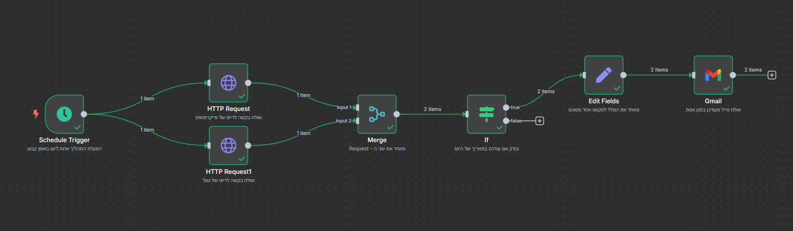

# GitHub Updates Tracker with n8n

This project is an automation built with n8n that monitors GitHub for new or recently updated repositories from major tech companies such as Google and Microsoft.  
Whenever a new repository is added or an existing one is updated, the system sends an email alert with key details.

---
### 1. Overview of the complete workflow  

---

##  Project Goals

- Learn how to build a full automation flow using n8n
- Understand how to work with the GitHub REST API
- Practice working with HTTP requests, API, JSON parsing, expressions, conditions, and scheduling
- Build a professional, well-documented repository from scratch

---

##  Table of Contents

- **[Setup and Installation](./01-setup/README.md)**
- **[Workflow Architecture](./02-workflow/README.md)**
- **[Workflow Example Files](./03-examples/README.md)**
- **[Learning Notes](./04-learning-notes/README.md)**
- **[Screenshots](./images/)**

---

##  Useful Links

- [n8n.io – Official Site](https://n8n.io)
- [GitHub REST API – Repositories](https://docs.github.com/en/rest/repos/repos)
- [n8n YouTube – Beginner Guide](https://www.youtube.com/watch?v=4BVTkqbn_tY&list=PLlET0GsrLUL59YbxstZE71WszP3pVnZfI&index=2)
- [n8n YouTube – Advanced Concepts](https://www.youtube.com/playlist?list=PLlET0GsrLUL5bxmx5c1H1Ms_OtOPYZIEG)
- [JSON Viewer – Helps visualize JSON output](https://jsonformatter.org/json-viewer)

---

